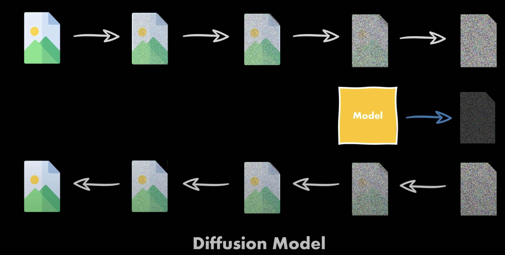
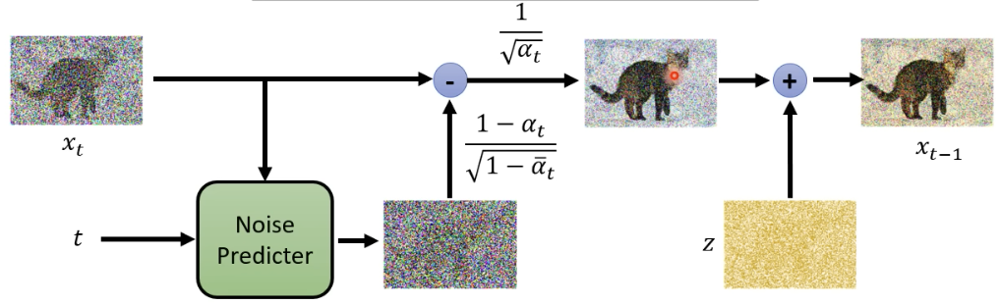

# Diffusion-model
## Introduction
It is a side project in 2023. The project is a Computer Vision topic. The languages and relevent packages are **Python - Pytorch**. The project aims to generate image using diffusion model. 

  

## Data
torchvision.datasets.StanfordCars, [link](http://ai.stanford.edu/~jkrause/cars/car_dataset.html). The cars dataset contain 16,185 images of 196 classes of cars. 
## Model
* Forward diffusion process: noise generation with $\alpha$ value, $\alpha$ value becomes smaller as $t$ increases. Each diffusion is the original image adding with noise.
$$q(x_{1:T}|x_{0}) = \prod_{t=1}^T q(x_t|x_{t-1})$$

$$q(x_t|x_{t-1}) \sim \mathcal{N}(x_t;\sqrt{1-\beta_t}x_{t-1}, \beta_tI)$$

$$X_t = \sqrt{\overline{\alpha_t}} X_{t-1} + \sqrt{1-\overline{\alpha_t}} \epsilon $$ 

$$\epsilon \sim \mathcal{N}(0, 1)$$
* Backward denoising process: A Unet $\epsilon_{\theta}$, containing downward, upward and skip connection between two paths. The noise is generated with gaussian distribution, then is feed into Unet with timestamp of the noise to predict the noise within the images.
$$p_\theta(x_T) = N(x_t;0, I)$$
$$q(x_{0:T}) = p(x_T)\prod_{t=1}^T p_\theta(x_{t-1}|x_{t})$$ 
$$x_{t-1} = \frac{1}{\sqrt{\alpha_t}}\Big(x_t - \frac{1-\alpha_t}{\sqrt{1-\overline{\alpha_t}}}\epsilon_\theta(x_t, t)\Big) + \sigma_t z$$
$$x_t \sim \mathcal{N}(0, I), z \sim \mathcal{N}(0, I)$$

  

## Result
<figure>
  
</figure>
The leftmost image is the denoising images at timestamp 0. And the rightmost image is the denoising images at timestamp 1000.

## Reference
https://github.com/lucidrains/denoising-diffusion-pytorch
